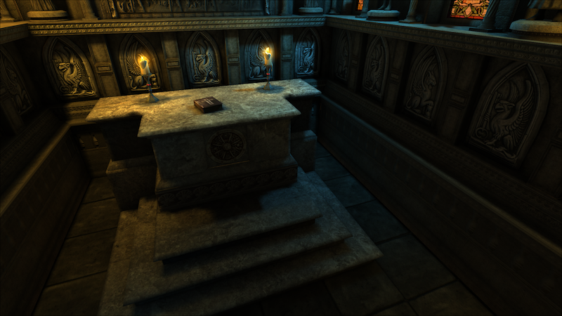

<h1 align="center">CRYPT</h1>

<strong>Unigine to Javascript using Emscripten</strong>
 2013

 
<h2>About</h2>
This project was the achievement of month of work trying to run a 3D game engine into a web browser without using any plugins. In order to have this engine working it was necessary to modify the source code of <a href="https://unigine.com">Unigine</a> Engine and work closely with <a href="https://emscripten.org">Emscripten</a> in order to improve the build speed and runtime speed to achieve a realtime rendering.

<h2>Copyright</h2>
This project is licensed under the terms of the MIT license and protected by Udacity Honor Code and Community Code of Conduct. See <a href="LICENSE">license</a>.